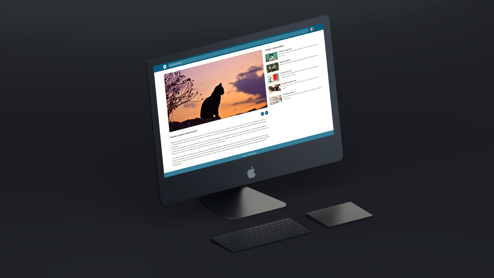

  
  

## 🖥️ Projeto

Esse é um projeto responsivo de uma página de artigos sobre gatos, desenvolvido durante desafio proposto no curso Explorer da Rocketseat.

## 🚀 Tecnologias

Esse projeto foi desenvolvido utilizando com as seguintes tecnologias:

- HTML
- CSS
- Git e Github

## 💡 Propriedades Utilizadas

- Utilização de Media Queries.
- Utilização de variáveis.
- Utilização de **filter** para as fotos.
- Utilização da propriedade **transform**.
- Utilização de animações.
- Utilização de keyframes.